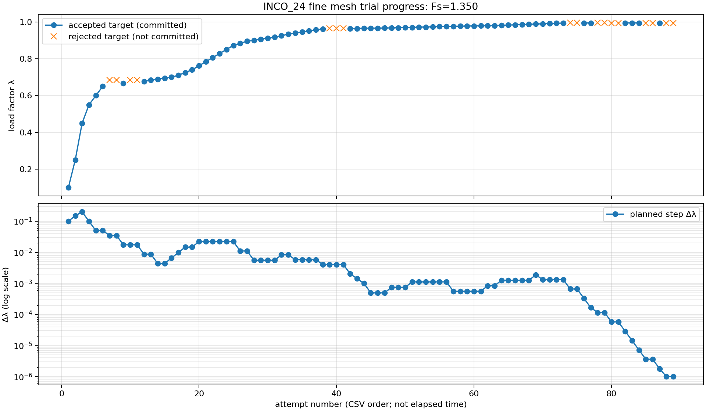
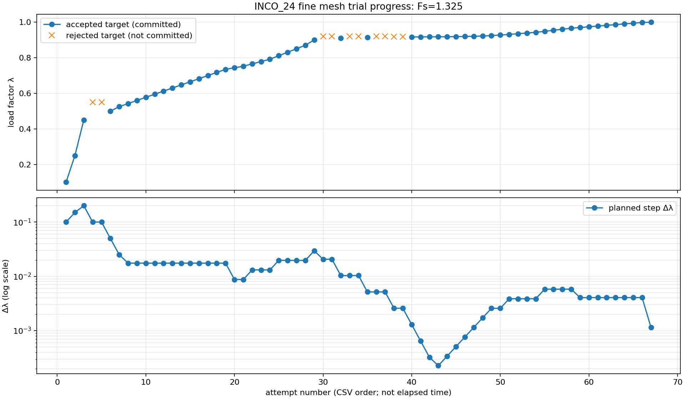

# INCONSISTENT SRM の失敗分析と改修記録

## 結論

旧版の失敗には、悪条件の全体接線を線形ソルバが解けない問題と、Q8のhourglass安定化が人工的な支持力を加える問題があった。線形方程式の反復改良と全体反復の再試行を追加し、INCONSISTENTのSRMでは材料応力から求める力で収束を判定するよう修正した。未収束試行を無条件に限界安全率へ採用する判定は追加していない。

今回の目的は、小変形の既存材料則で限界Fsを求められるか確認すること。大変形の実装は、この確認の後に行う。

最終版INCO_24では6物理条件・8メッシュすべてで数値的なFs区間が成立し、材料力残差と3主応力の降伏条件を独立に確認した。材料力残差の最大値は1.4713×10⁻⁶で、許容値1×10⁻⁵以内。文献代表値との中点差は−3.13～＋1.14%、主比較の粗密差はφ=20°で0.92%、φ=0°で0.85%となり、今回の小変形Fs検証の事前基準を満たした。大変形との比較に使用する小変形の基準結果として残す。ただし、細メッシュは約10.12時間を要し、変形が大きい条件も残る。大変形は今回実装していない。

主比較は [Griffiths・Lane (1999)](https://inside.mines.edu/~vgriffit/slope64/Griffiths%20and%20Lane%201999) の均質φ=20°斜面と均質φ=0°斜面で、それぞれ粗密2メッシュを使用する。基礎地盤付き斜面と [Pruškaのソフト比較](https://data.fine.cz/handbooks-chapter-pdf/16_comparison_of_geotechnic_softwares_geo_fem_plaxis_z-soil.pdf) の3条件は補助比較とする。後者は初期応力・側方境界が完全一致していない。参照条件の復元・独立Bishopとの関係は [先行検証](PRACTICAL_SRM_VALIDATION.md) に記録している。

同論文p.389は斜面安定解析にψ=0の非関連流動則を採用しており、今回の設定と整合する。Example 1の1.380はBishop–Morgensternの比較値で、論文のFEM試行は1.35で収束・1.40で非収束である（p.392）。Example 3の1.47は非排水・全応力Tresca条件のTaylor値である（pp.394–395）。φ=0ではcを非排水せん断強度として扱い、φ=20°の強度条件と区別する。両主比較とも入力は文献からの再構成であり、原論文のメッシュ・境界を完全に複製した試験ではない。

配布設定の `FLOW_POLICY` はDAVISのままである。今回のINCONSISTENTの検証条件を使う場合は「解析設定」C10を `INCONSISTENT` にする。Q8係数C11は0.05、SRMのψはKEEP、入力ψは0を維持する。流れ則を変更したDAVISの表示Fsと混ぜて評価しない。

検証用コピーではC15（上限Fs）を2.2、C16（終了区間幅）を0.0125、C19（固定Fs）を0に設定した。配布保存値は上限3.0・区間幅0.02であり、元の74設定を保持している。再現には同梱の文献フィクスチャと実行スクリプトを使用する。

## 診断結果

INCO_16 の φ=0 粗メッシュ失敗では、GMRES の最終相対残差が `0.8857` で停止した。保存した失敗行列は自由度1282の対称正定値行列だったが、条件数は約 `2.0616×10^9` と大きい。したがって、非対称性だけでなく、悪条件行列に対する前処理と反復解法の不足が主因候補である。

帯域LUの反復改良を追加し、元のCSR行列で真残差を再計算するようにした。記録された改良後の真残差は `3.8776×10^-9` で、既存の収束判定を緩めずに条件を満たした。改良は最大5回で、合格しない場合は従来どおりGMRESへ戻る。

INCO_24のφ=20°細メッシュでは、Fs=1.35の最後の受理が載荷率 `0.9942770666975`、全体残差 `9.968835068407×10^-6` だった。次の最小刻み `1×10^-6` でNewtonが100回の上限に達し、確定状態へ戻した再試行もラインサーチで残差を減らせず終了した。最終記録残差は `1.008191736346×10^-5`。`increment_summary.csv` の試行326～328と `run.log` にこの経路を保存した。許容残差を緩めて合格へ変更せず、外側のFs探索を続けた。この停止は反復・刻み制約を含む数値上の境界であり、それだけで力学的な崩壊Fsを証明しない。

次の図は、この完了したFs=1.35試行と、全荷重まで収束したFs=1.325試行の推移。青は受理された載荷率、橙は保存しなかった失敗試行の目標である。横軸は各試行のCSV順であり、経過時間ではない。下段は予定した荷重刻みを対数軸で示す。Fs=1.325では小刻みから回復して載荷率1.0に到達したが、Fs=1.35では最小刻みまで縮小した。





[Fs=1.35の抽出CSV](inconsistent-evidence24/progress/trial_progress_1p350.csv)、[Fs=1.325の抽出CSV](inconsistent-evidence24/progress/trial_progress_1p325.csv)、[元ログとの対応とSHA-256](inconsistent-evidence24/progress/manifest.json)に、使用した156行と元CSVの行番号を残した。これらは完了した個別Fs試行の資料であり、最終探索区間の表とは区別する。

## 改修内容

- 帯域LUの各段階のピボット行と下三角乗数を保存し、残差補正を同じ因子で再求解。
- ILU(0) の極小・非有限対角、乗数、最終対角を検出し、失敗位置をログへ出力。
- GMRES の再始動ごとに前処理方式と元行列による真残差を記録。
- Givens回転、Krylovノルム、前処理適用、上三角対角の数値崩壊を記録。
- 非対称帯域LUの失敗理由をピボット、残差、非有限値に分類。
- 非収束時に直前の有効状態を保持し、失敗試行の変位を収束解として扱わない。
- 材料力残差、全体反復、線形解法の残差を別々に記録。
- 状態安全な再試行、因子再利用条件、共有予算を整理した。

## 試行履歴

V17ではQ8 hourglass係数の影響を確認した。係数0.05ではFs区間 `[1.4875, 1.5]` が得られたが、変位約161 m、材料力残差約0.510であり、実用的な収束解とは扱えない。係数0では `[1.4625, 1.475]` で、材料力残差は約 `1×10^-10` だった。この比較から、hourglass安定化を有効にした結果だけでFs精度を判断しない方針とした。

以下は改修途中の対照計算であり、最終版の8ケースとは別に記録する。変位・ひずみは全荷重の収束下端Fsで保存した値。固定Fsは限界Fsを求めた試験ではない。

ひずみは各要素の4積分点で、εx・εy・工学せん断ひずみγxyの絶対値を比較する。変形後の勾配det(I+∇u)も同じ積分点での診断値であり、大変形の形状更新を行った解析値ではない。

|対照|Fs区間・固定値|独立材料力残差|最大変位ベクトル|最大局所微小ひずみ成分|評価|
|---|---:|---:|---:|---:|---|
|17・φ=0・旧安定化力0.05|1.4875～1.5000|0.50980|160.896 m|7750.3%|人工的な支持力を含み、不採用|
|17・φ=20・旧安定化力0.05|固定1.35|0.002947|0.01236 m|0.855%|小さい変位でも材料力が釣り合わず、不採用|
|17・φ=0・係数0|1.4625～1.4750|1.0165×10⁻¹⁰|1.04664 m|86.18%|材料力は合格。変形の物理評価は未確認|
|20・φ=0・材料力のみ、Newtonに安定化剛性|1.4500～1.4625|3.0055×10⁻⁶|0.07197 m|3.844%|釣合いは合格。補正経路の感度を確認|
|21・φ=0・材料力とNewton接線が一致|1.4625～1.4750|1.0165×10⁻¹⁰|1.04664 m|86.18%|参照1.47を含む。17の係数0と同じ区間・保存状態|

反力の総和や降伏条件だけでは、この人工力を検出できない。hourglass力が自己釣合いして全反力を変えない場合もあるため、自由節点ごとの材料内力と自重を独立に照合する。

|版|変更・評価|
|---|---|
|INCO_17|LU反復改良、線形求解失敗・全体停滞時の残差最小化。標準hourglass力ではFsが近くても材料力が釣り合わないことを発見。|
|INCO_18|回復反復の予算超過理由と補正量の記録を修正。φ=0粗メッシュでは17と同じ結果。旧hourglass力の細メッシュ対照は途中停止し、完了Fsとして扱わない。|
|INCO_19|CSRの行・列・全係数が完全一致する場合だけ帯域LU因子を再利用。失敗したSRM増分を確定状態に戻し、弾性行列で再試行。|
|INCO_20|INCONSISTENTのSRMを含む計画でhourglass力を除外。Newtonの行列にはまだ安定化剛性を加えた中間版。|
|INCO_21|Newton行列も材料内力の接線に一致させた。hourglass剛性は弾性補正方向を作るときだけ使用。|
|INCO_22|細メッシュの先行自重載荷で、Newton反復100回・残差約1.1×10⁻⁵の停止を再現。弾性補正の再試行をSRM試行だけでなく、SRM計画内の先行自重・載荷再現にも適用。|
|INCO_23|成功した弾性補正を同じ載荷ステージの次増分へ引き継ぐ。引継ぎ経路が失敗した場合は確定状態へ戻してNewtonで1回再試行する。細メッシュではNewton因子化が1回約5秒を占めていたため、毎増分で同じ停滞経路に戻る処理を改善した。並列検証中の時間であり、速度倍率の比較には使わない。|
|INCO_24|引継ぎを100反復以下、かつ荷重進捗が初期増分の5%以上の成功に限定。小さい進捗のまま弾性補正を継続した23に対し、φ=20°粗メッシュのFs1.1・1.2を先に完了。最終8ケースをこの固定版で再検証。|

INCO_25_PROBEは別の試作として、弾性行列で補正している間の有限差分接線計算を省略する。応力・塑性状態の更新は行い、増分の保存直前には完全な材料更新と従来の力・補正量・拘束変位の判定を再実施する。材料点125条件で応力・塑性状態の一致、失敗分類14条件、完全更新前後の保存を小モデル4条件で確認した。完全更新を失敗させる2条件では、確定した変位・応力へ戻り、Fsを保存しなかった。

φ=20°粗メッシュ・固定Fs=1.35・係数0.05の対照では、24と25の全節点変位、積分点応力、保存された材料状態が完全一致した。独立材料力残差はともに5.7084×10⁻¹⁰。ただし、これは1つの固定Fsの確認で、限界Fsの探索ではない。並列検証の所要時間は24が2388.079秒、25が2392.487秒で、速度改善を示す比較としては扱わない。配布版は8ケースの限界Fsを検証する24とし、この試作は見送る。

## 収束判定と状態の保持

通常のNewton反復が解けない場合は残差最小化を試し、それでも失敗したSRM計画内の増分は直前の確定材料状態・変位へ戻して、同じ荷重目標を弾性行列で再試行する。弾性行列を使うのは変位補正の方向だけで、試行応力・降伏条件・ψを変更しない。採否は実際の材料内力とラインサーチで判断する。

Newtonは最大100回、弾性補正は最大1000回。各試行内では回復反復・watchdogが同じ上限を共有する。同じ荷重目標でのモード切替は各方向を1回までに制限し、循環させない。成功した弾性補正は100反復以下・基準増分の5%以上の進捗の場合だけ引き継ぎ、遅い成功・小さな進捗・ステージ・関数入口ではNewtonへ戻す。どちらの切替も直前の確定状態から開始する。容量超過・全体特異・取消は再試行の対象にしない。力の釣合いの許容値1×10⁻⁵、線形解法の相対残差1×10⁻⁸、材料の許容値は変更していない。

SRMを含まないINCONSISTENT解析とDAVISの安定化力は従来の経路を保持している。今回のhourglass力の診断はINCONSISTENTのSRMに対するもので、DAVISの物理的妥当性を新たに認定したものではない。

## 再現・独立確認

- 保存した1282自由度の失敗行列と、行を交換した対照行列をExcelの改修LUで再求解。いずれも680回のピボット交換と1回の反復改良を経て、真残差3.8776×10⁻⁹で合格。
- 因子再利用は右辺だけの変更で許可し、係数・CSR配列変更、特異行列、メモリ制限を含む6試験で確認。
- INCO_21で材料の75積分点試験と50複合サブステップ試験、非対称求解、残差最小化、失敗時Fs保存、watchdogの状態復元を確認。21→24で材料則・線形求解のコードが同一であることを記録し、最終版で失敗行列を再求解した。
- 接合・BIRTH/DEATH・MATSET・RESET・載荷/除荷などをINCONSISTENTとDAVIS各10ケースで確認。
- 解析後のQ8応力を独立に積分し、材料内力と自重の自由節点残差を計算する。[独立材料力監査](../tests/literature/audit_material_force.py) はhourglass力を含めない。収束値の近さと、この力の釣合いを別々に評価する。

独立材料力監査の相対残差は、自由DOFの材料力残差ノルムを自由DOFの自重ノルムで除した値。支持点側の自重で残差を希釈しない。監査v3では旧来の全DOF自重による値も比較用に併記するが、合否には自由DOF基準を使用する。対照表も同じ基準で再計算した。[正規化の回帰試験](../tests/literature/check_material_audit_norm.py)では、自由DOFを1つに限定した未釣合い状態の拒否と、自由DOF荷重ゼロの拒否を確認した。

応力保存値について、Fsで低減したc・φに対するMohr–Coulomb条件も独立に確認する。結果JSONのσx・σy・τxy・σzから3主応力を再構成し、ブックが出力する主応力・降伏関数を使わずに最大・最小主応力の降伏条件を計算する。これは応力の強度条件と釣合いの確認であり、変形後の形状や塑性流れの履歴を独立に認定するものではない。

新しい診断イベントは `CSR_ILU`、`GMRES_RESTART/BREAKDOWN`、`NONSYM_BAND_REFINEMENT/REJECT`、`REGULARIZED_CORRECTION_REQUEST`、`ELASTIC_CORRECTION_RETRY/CARRY/RELEASE`、`NEWTON_CORRECTION_RETRY`、`SRM_MATERIAL_FORCE`。Fs、荷重目標、失敗理由、前処理方式、元行列の残差を記録する。線形残差が十分小さくても全体残差が減らない場合を、線形求解失敗から区別できる。

再計算の代表例は次のとおり。実行前に原本をコピーし、Windowsのデスクトップ版ExcelとVBAプロジェクトへのアクセス許可を用意する。文献条件は材料・許容値を参照Fsに合わせて調整せず、固定したフィクスチャを使用する。

```powershell
powershell -NoProfile -ExecutionPolicy Bypass -File tests/inconsistent/run.ps1 -SourceWorkbook workbook/2DSoilFEM_20261008_practical.xlsm -OutputRoot tests/tmp/inconsistent_recheck
powershell -NoProfile -ExecutionPolicy Bypass -File tests/literature/run_cases.ps1 -Mode SRM -Names griffiths_1999_phi0_coarse -FlowPolicy INCONSISTENT -FixturePath docs/inconsistent-evidence24/fixtures.json -SourceWorkbook workbook/2DSoilFEM_20261008_practical.xlsm -CaseSuffix _recheck -OutputRoot tests/tmp/inconsistent_srm_recheck
```

全探索の確認には `SRM_FIXED_FS=0` を使用する。固定Fsの合格だけでは限界Fsの確定にならない。`run_cases.ps1` は原本・フィクスチャのSHA-256、実行前ブックのSHA-256、計算部の版、設定、専用Excelの識別番号を実行開始時に記録する。結果のPDFと図は別の表示確認で作成し、実行前後のファイルを区別する。

## 最終版INCO_24の結果

固定した6物理条件・8メッシュの全探索を完了し、8/8で数値的なFs区間が成立した。成立した8件は、保存下端の材料力の釣合いと全3次元Mohr–Coulomb降伏条件を独立に確認した。
区間は収束する下端と、現在の反復・載荷刻みで収束しない上端の組合せであり、厳密な力学的上下界ではない。保存FSSは下端である。中点は文献値との差を比較するために表示し、未収束の上端を収束解として保存しない。

完了 8/8。中点差は表の代表比較値に対する差。参照FEM区間と初期応力・境界条件の一致度は別途確認する。

|条件|代表比較値|今回のFs区間|中点|中点差|独立材料力残差|
|---|---:|---:|---:|---:|---:|
|Griffiths・φ20・200Q8|1.38|1.3500～1.3625|1.35625|-1.72%|5.708e-10|
|Griffiths・φ20・450Q8|1.38|1.3375～1.3500|1.34375|-2.63%|1.471e-06|
|Griffiths・基礎地盤・240Q8|1.40|1.3500～1.3625|1.35625|-3.13%|4.050e-09|
|Griffiths・φ0・192Q8|1.47|1.4625～1.4750|1.46875|-0.09%|1.017e-10|
|Griffiths・φ0・432Q8|1.47|1.4500～1.4625|1.45625|-0.94%|2.104e-08|
|Pruška・H7・φ10・240Q8|1.22|1.2250～1.2375|1.23125|+0.92%|3.353e-09|
|Pruška・H7・φ20・240Q8|1.65|1.6625～1.6750|1.66875|+1.14%|3.771e-11|
|Pruška・H10.5・φ10・240Q8|0.84|0.8125～0.8250|0.81875|-2.53%|5.705e-08|

|条件|最大変位ベクトル|積分点の最大微小ひずみ成分|積分点の最小det(I+∇u)|全3D降伏条件|
|---|---:|---:|---:|---|
|Griffiths・φ20・200Q8|12.44 mm|0.87%|0.9984|PASS|
|Griffiths・φ20・450Q8|10.52 mm|0.57%|0.9984|PASS|
|Griffiths・基礎地盤・240Q8|27.09 mm|1.17%|0.9975|PASS|
|Griffiths・φ0・192Q8|1046.64 mm|86.18%|0.9701|PASS|
|Griffiths・φ0・432Q8|77.55 mm|6.63%|0.9958|PASS|
|Pruška・H7・φ10・240Q8|780.61 mm|24.37%|0.9326|PASS|
|Pruška・H7・φ20・240Q8|1024.14 mm|54.61%|0.9057|PASS|
|Pruška・H10.5・φ10・240Q8|949.16 mm|35.73%|0.9256|PASS|

FSSの保存値は区間の収束下端。変位・ひずみは全荷重の下端Fsでの状態。ひずみ成分はεx・εy・工学せん断ひずみγxyを各要素の4積分点で評価した最大値。大変形の形状更新を含む評価は今回実施していない。

代表値との比較とは別に、文献に示されたFs範囲も照合する。Griffiths・Laneのφ=20°の1.38はBishop–Morgensternの比較値で、FEMは1.35～1.40、φ=0°は有限要素計算の1.45～1.50とTaylor値1.47を区別する。基礎地盤付きは1.35～1.40を参照し、その1.40は代表比較値である。Pruškaの3条件は順に1.21～1.31、1.64～1.71、0.83～0.91。初期応力や境界の復元が不完全な補助比較を、完全一致した再現試験として扱わない。

|主比較|粗メッシュ中点|細メッシュ中点|中点の変化率|2%基準|
|---|---:|---:|---:|---|
|φ=20°|1.35625|1.34375|0.92%|基準内|
|φ=0°|1.46875|1.45625|0.85%|基準内|

粗密の中点変化率は粗メッシュ中点を分母にした絶対差。今回の事前確認基準は2%であり、他の形状・材料にも同じ精度を保証するものではない。材料力と反力の残差は別々に監査した。

各メッシュの変位・ひずみは、それぞれの収束下端Fsで保存した値である。粗密で下端Fsが異なる場合、同じFsでの変位比較にはならず、この表から変位のメッシュ収束を判定しない。

|条件|全探索の所要時間（時間）|
|---|---:|
|griffiths_1999_coarse|3.97|
|griffiths_1999_fine|10.12|
|griffiths_1999_foundation|2.91|
|griffiths_1999_phi0_coarse|1.71|
|griffiths_1999_phi0_fine|5.13|
|pruska_h10.5_phi10|4.19|
|pruska_h7_phi10|4.41|
|pruska_h7_phi20|2.36|

所要時間は先行自重載荷、Fs探索、収束下端の復元を含む実測値。複数のExcelを同時実行しており、速度倍率や他の版との速度順位には使用しない。とくに細メッシュで長い反復が必要だったことは、実務上の計算時間の課題として残る。

大きな局所ひずみが出た収束下端については、微小変形の範囲に収まったとは評価しない。文献Fsとの一致は小変形SRMの数値ベンチマークとしての一致であり、実際の変形後形状に対するFsや変位を保証しない。とくにFs<1の条件は、元の強度で安定していることを示す結果ではない。

## 検証資料

- [ケース別Fs・残差・変形一覧](inconsistent-evidence24/results_table.md)
- [設定・原本識別・反力・数値判定の監査](inconsistent-evidence24/practical_comparison.json)
- [独立材料内力・全3次元降伏条件の監査](inconsistent-evidence24/material_force_audit.json)
- [最終8ケースの実行ブック・生ログ・PDF・原本](inconsistent-evidence24/srm_cases_INCO24.zip)
- [旧版の失敗行列・改修途中の対照・回帰試験](inconsistent-evidence24/diagnostics_INCO16_24.zip)
- [8ケースの固定入力条件](inconsistent-evidence24/fixtures.json) / [検証基準](inconsistent-evidence24/protocol.json)
- [8ケース・24枚のPDF表示確認記録](inconsistent-evidence24/visual_qa.json)
- [アーカイブ内各ファイルのサイズとSHA-256](inconsistent-evidence24/archive_entries.json)

配布ブックのビルドは`20261010_INCO_24`、原本SHA-256は`83b1e4d527c0a9920603d052743df829abc552a582d319e29f20f8776a132856`。各実行の開始時にこの原本と固定フィクスチャを識別し、計算後の表示確認を別記録にした。複数のExcelを同時実行した所要時間は、速度倍率の評価には使用しない。

## 限界と今後

今回の改修は小変形・既存形状のSRMに限定している。大変形、形状更新、間隙水圧を含む解析は対象外であり、後段へ延期した。Fsを採用するには、少なくとも材料力残差と全体真残差が許容値内で、探索区間が成立し、再試行・メッシュ・載荷増分に対して安定することを確認する必要がある。

旧版でFsを確定できなかった文献条件を、材料力の釣合いを変えずに再探索した。次の大変形実装では今回の小変形Fsを基準として、形状更新に伴う差を別に検証する。今回の最終8件すべてを再度独立実行したわけではなく、再試行経路・粗密メッシュ・改修途中の対照による確認である。旧版の検証記録は [限界安全率と実用性の検証](PRACTICAL_SRM_VALIDATION.md) に履歴として保持する。

本記録は限定したベンチマークと同一材料・同一流れ則の検証記録であり、一般の実務解析への一括認証を意味しない。
