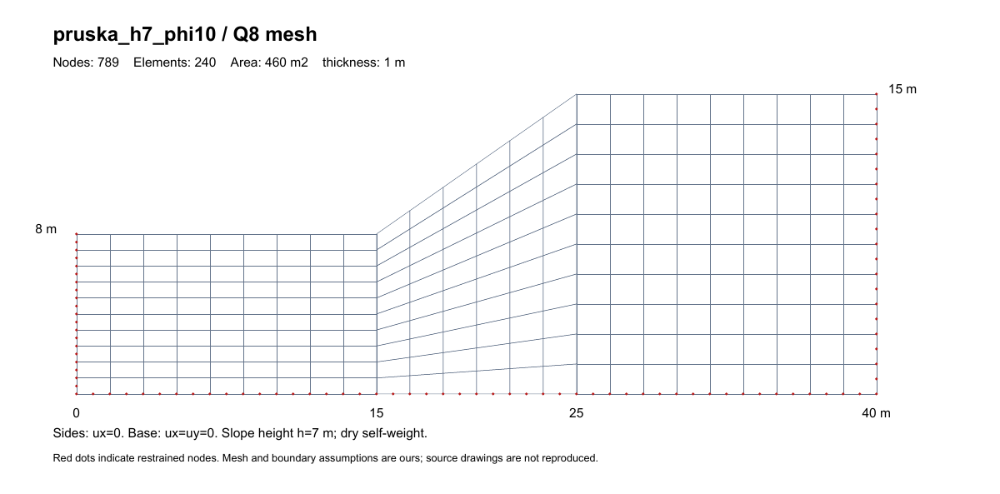
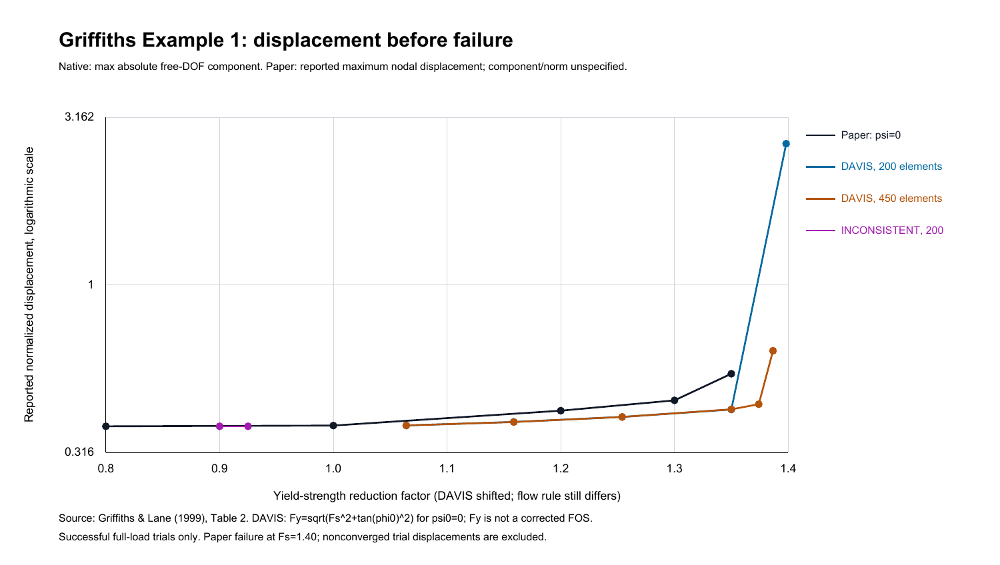
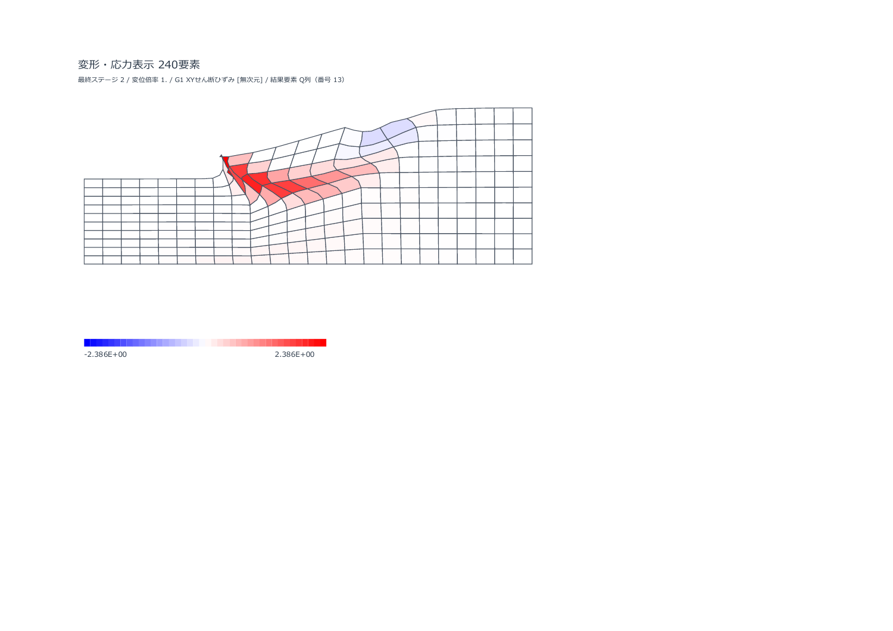
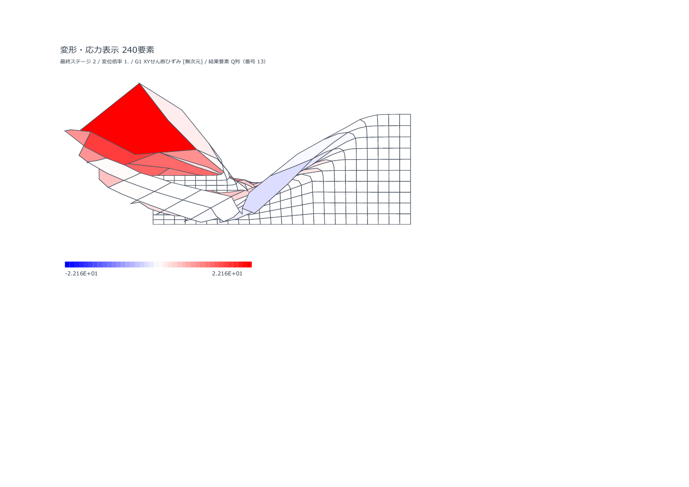

# 文献・理論解によるExcel実機検証（2026-10-09）

この文書の数値・XLSMは修正前の `20261009_BEST_03_R1` の歴史的検証です。現在の修正版は [INCONSISTENT修正報告](INCONSISTENT_REPAIR.md) に別記しています。

対象は `20261009_BEST_03_R1` の実務ブックです。原本のSHA-256は `1e45f152d2c2f7332ec6ccb4a5dba5438570d301888fe66ab227c42c38e922ce`。デスクトップ版Excel 16.0 / Build 20430で作業コピーを実行し、計算VBA・収束判定・材料モデルは変更していません。

**弾性の載荷・反力は理論式と一致しました。SRMは、標準DAVISでは文献の安全率付近に到達する一方、破壊直前の変位に差があり、非関連流れ則を直接使う設定には早い非収束が残ります。SRM全般を検証済みとは扱いません。**

## 選んだ資料と入力

|資料|今回使った条件|比較の限界|
|---|---|---|
|[Griffiths & Lane (1999), Géotechnique 49(3), 387–403](https://inside.mines.edu/~vgriffit/slope64/Griffiths%20and%20Lane%201999)|Example1、乾燥2:1斜面、φ=20°、ψ=0、c/(γH)=0.05、Table2の安全率・変位|H=10m、γ=20kN/m³、c=10kPaで無次元比を一致。E=100000kPa、ν=0.3は本文のnominal値。元の節点表・反復法は再現していない。|
|[Pruška, Comparison of geotechnic softwares – Geo FEM, Plaxis, Z-Soil](https://data.fine.cz/handbooks-chapter-pdf/16_comparison_of_geotechnic_softwares_geo_fem_plaxis_z-soil.pdf)|均質斜面、E=5000kPa、ν=0.3、γ=24kN/m³、c=20kPa、ψ=0。h7m/φ10°、h7m/φ20°、h10.5m/φ10°|原著の初期応力はK0法だがK0・生成手順が不明。今回は応力ゼロから自重載荷。側面・底面拘束も補っている。|
|[RS2 Slope Stability Verification, Part2](https://static.rocscience.cloud/assets/verification-and-theory/RS2/RS2_SlopeStabilityVerification_Part2.pdf)|Problem56、PDF67–70ページ／冊子155–158ページでPruška斜面の横寸法15+10+15mを確認|メーカーによる文献の再現資料。今回の実行結果とは区別。|
|[Itasca 等方弾性モデルの公式式](https://docs.itascacg.com/itasca900/common/models/elastic/doc/modelelastic.html)|Hooke則から独立に導いた平面ひずみの圧縮・自重・単純せん断|[単一要素載荷例](https://docs.itascacg.com/itasca900/flac3d/zone/test3d/ConstitutiveModels/SingleZoneVonMises/singlezonevonmises.html)を参考に弾性部分を拡張。Von-Mises塑性モデルの再現ではない。|

いずれも間隙水圧荷重を入れない条件です。乾燥状態では文献のc′・φ′を使っても、水圧を差し引く処理は発生しません。圧密・浸透・水位変動を検証した結果ではありません。文献PDF本文や図の転載は同梱せず、条件とリンクだけを保存しています。

今回の外部ベンチマークは乾燥・平面ひずみ・Q8、均質SOILと弾性STRUCTです。JOINT、BIRTH/DEATHの施工解析、オートメッシュの文献照合は含みません。それらの既存動作確認は[別の回帰試験記録](https://github.com/tak063495-prog/excel-vba-soil-fem/blob/main/docs/VALIDATION.md)を参照してください。

Griffiths形状は (0,0),(32,0),(12,10),(0,10) の台形。左面ux=0、底面ux=uy=0。Q8の200要素・450要素で比較します。Pruškaは幅40m、下段高さ8m、下段15m・斜面run10m・上段15m、左右ux=0、底面ux=uy=0の240要素です。原著はψ=0ですが、DAVIS試験は等価関連c*,φ*への置換を含み、完全な同一条件ではありません。

## 弾性の5載荷条件

幅4m、高さ2m、厚さ1m、E=10000kPa、ν=0.25、37節点・8個のQ8要素です。塑性が生じないSTRUCT材料を使い、全37節点の変位・全32積分点の面内応力3成分・支持反力を独立の理論式と比較しました。Q8上辺の荷重は L/6,2L/3,L/6 の一致節点力にしています。

|ケース|荷重・拘束|理論式／主な期待値|
|---|---|---|
|confined_pressure|側面ux=0、底面uy=0、q=100kPa|M=12000kPa、uy=-qy/M、σy=q、σx=νσy/(1-ν)、鉛直反力400kN|
|confined_gravity|同じ拘束、γ=20kN/m³|uy=-γ(Hy-y²/2)/M、σy=γ(H-y)、鉛直反力160kN|
|confined_combined|上記のqと自重|線形重ね合わせ、鉛直反力560kN|
|unconfined_pressure|底面uy=0、左下1点ux=0、q=100kPa|uy=-(1-ν²)qy/E、ux=ν(1+ν)qx/E、σx=0、鉛直反力400kN|
|simple_shear|全節点uy=0、底面ux=0、上面τ=50kPa|G=4000kPa、ux=τy/G、水平反力-200kN|

M=E(1-ν)/[(1+ν)(1-2ν)]、G=E/[2(1+ν)]です。保存応力は圧縮正のテンソル表現なので、右向き上面せん断の保存τxyは-50kPa。比較ではこの符号を明示的に換算しています。

|ケース|最大変位絶対誤差 m|最大応力絶対誤差 kPa|最大反力誤差 kN|理論照合|
|---|---:|---:|---:|---|
|confined_combined|1.273e-13|1.299e-09|1.137e-13|PASS|
|confined_gravity|1.123e-14|2.075e-10|2.842e-14|PASS|
|confined_pressure|1.273e-13|1.299e-09|2.274e-13|PASS|
|simple_shear|2.140e-14|6.545e-10|5.684e-14|PASS|
|unconfined_pressure|2.637e-13|1.623e-09|5.630e-14|PASS|

判定閾値は変位1e-8×max(1,理論値最大)、応力1e-7×max(1,理論値最大)、反力1e-7。丸め誤差を許容した照合であり、塑性・SRMの正解性を示す試験ではありません。

### 材料点の追加照合

ψ=0、E=100000kPa、ν=0.3、c=10kPaで、φ=0°/20°の一方向拘束圧縮（弾性・塑性・大きい塑性増分）とφ=0°の純せん断、計7条件を材料更新APIへ直接入力しました。平均応力p=Kεy、試行q=2Gεy、MC降伏面上のq=(2c cosφ+2p sinφ)/(1-sinφ/3)から求める応力、純せん断の上限τ=c、およびψ=0の塑性体積ひずみ0と照合し、7/7が一致しました。最大応力誤差は約1.3e-12kPaです。これは限定した応力経路の確認で、全材料分岐の認定ではありません。

別に内蔵自己テストを実行すると、`plastic_loading_psi0` と `zero_cohesion` の2例がFAILでした。原入力は大きな負の一方向ひずみで、現在の圧縮正モデルでは強い平均引張を与えます。ψ=0では塑性体積ひずみで平均応力を戻せず、MC頂点の許容範囲外となる入力へ成功を期待するテストの不整合です。材料更新は失敗コード4103を返しています。作業コピーの自己テスト入力だけを ex=0.01,ey=-0.009へ置換すると内蔵試験はPASSし、独立の7理論照合も維持しました。元の配布VBAは変更していません。修正する場合は、元の引張例を失敗の期待試験として残すことも必要です。

[修正前の記録](literature-evidence/material_point_checks_original.json) と [作業コピーでの入力修正候補](literature-evidence/material_point_checks_trial_repair.json) を分けて保存しています。SRMのINCONSISTENT全探索ログではMaterialUpdateFailed=0であり、この2自己テストの入力不整合を早いSRM非収束の原因とは扱いません。

材料APIが返す3×3接線も差分照合しました。塑性状態からΔεy=1e-7を追加し、各ひずみ方向を±hで摂動する中心差分です。φ=0°の塑性点とφ=20°の一部の塑性点では、返却接線と差分接線の相対Frobeniusノルム差がそれぞれ22.49%、18.99%でした。h=1e-9と3e-9の両方で同じ差が残ります。全摂動点の材料更新は成功し、塑性状態を維持しています。前進・後退差分も記録し、通常の数値丸めより大きな差であることを確認しました。稜線では滑らかな一意の接線を仮定できないため、応力更新自体の誤りとは直ちに断定せず、稜線分岐と返却接線の整合性を検証する課題です。φ=20°の別の大きい塑性点からの再載荷では差はほぼ0でした。

φ=20°の有効な塑性状態の一例では、非対称な法線接線の差が約64338kPaで、(K+Kᵀ)/2で対称化した2×2法線ブロックの最小固有値は約-5349kPaでした。非関連流れ則の非対称性を対称近似へ置き換える影響を調べる根拠ですが、この値だけで全体解の不安定や原因を確定しません。今回の差分診断は材料サブステップOFF、最大1ステップです。旧有限差分接線関数を無条件に有効化する変更も行っていません。

## SRM全探索の実測

自重→SRM、SRM_MODE=REAPPLY、ψの入力は0、SRM_PSI_POLICY=KEEP。SRM_FMAX=2.2、区間幅0.0125、BAND_LU、RCM=ONです。V1/V2a/V4/適応選別ON、V2b/V3/V5/追加増分回復/fresh LU試験OFFの配布標準選別を使っています。各Fsは元の状態から自重を再載荷します。

|ケース|流れ則処理|要素数|数値PASS側Fs|数値FAIL側Fs|中点Fs|c・tanφだけの換算区間|文献の参照値|
|---|---|---:|---:|---:|---:|---|---|
|griffiths_1999_coarse|INCONSISTENT|200|0.92500|0.93750|0.931250|同じ|1.4|
|griffiths_1999_coarse_davis|DAVIS|200|1.35000|1.36250|1.356250|1.3982–1.4103|1.4|
|griffiths_1999_fine_davis|DAVIS|450|1.33750|1.35000|1.343750|1.3861–1.3982|1.4|
|pruska_h10.5_phi10_davis|DAVIS|240|0.82500|0.83125|0.828125|0.8436–0.8497|0.83–0.91|
|pruska_h7_phi10_davis|DAVIS|240|1.23750|1.25000|1.243750|1.2500–1.2624|1.21–1.31|
|pruska_h7_phi20_davis|DAVIS|240|1.68750|1.70000|1.693750|1.7263–1.7385|1.64–1.71|

文献の参照値はGriffithsのFEM破壊点1.40、Pruškaの3コードのMohr-Coulomb結果範囲です。これをExcelの区間中点という単一値に置き換えて同一視しません。原著の非収束判定や反復上限とも異なります。所要時間は診断としてCSVに残しましたが、独立Excelインスタンスで並行実行しているため速度優劣のベンチマークには使いません。

DAVISは各試行で強度低減後の材料へ適用されます。この単一SOIL・入力ψ=0のケースでは、φr=atan(tanφ0/Fs)、β=cosφr、c*=c0β/Fs、tanφ*=tanφ0β/Fs、ψ*=φ*です。したがって **cとtanφだけを通常の強度低減へ換算すると Fy=Fs/β=√(Fs²+tan²φ0)**。このFyは流れ則を一致させるものでも、補正済みの安全率でもありません。

例えばGriffithsの表示Fs=1.35ではFy≈1.3982です。表示Fs=1.35同士で変位を比べると、降伏強度自体が異なります。表は表示Fs区間とFy区間を分け、下のグラフはDAVISだけ横軸をFyへ換算しています。Fy区間が論文の1.4付近でも、ψ*=φ*と原著ψ=0の違いを含むため再現一致の認定には使いません。

### Griffithsとの応答比較

論文Table2はFs=1.35で収束、1.40で1000反復の上限に達したと報告しています。今回のExcelでは、追加の1000反復打切りを導入せず、既存の最小荷重増分・再試行・非収束判定まで実行しました。試行途中の非収束時変位は、全自重を支持した平衡変位とは比較しません。

Excelのログ `umax` は自由DOFのX/Y成分の絶対値最大です。原著の表記は最大節点変位で、成分最大かベクトルノルムかを本文から確定できませんでした。次表・グラフはログ成分最大を使う参考比較で、変位の厳密な誤差認定ではありません。完了状態の成分最大とベクトルノルムを比較CSVに別列で保存しています。200要素のFs=1.35では両者は0.052859mと0.053825mで、どちらを使っても原著の約0.01088mとの差は大きく残ります。

|モデル|表示Fs|c・tanφ換算Fy|E umax/(γH²)|同じ表示Fsでの論文値（強度は異なる）|数値状態|力学診断|
|---|---:|---:|---:|---:|---|---|
|griffiths_1999_coarse_davis|1.200|1.2540|0.4043|0.4220|CONVERGED|STABLE|
|griffiths_1999_coarse_davis|1.300|1.3500|0.4254|0.4530|CONVERGED|STABLE|
|griffiths_1999_coarse_davis|1.350|1.3982|2.6430|0.5440|CONVERGED|LIMIT_STATE|
|griffiths_1999_fine_davis|1.200|1.2540|0.4042|0.4220|CONVERGED|STABLE|
|griffiths_1999_fine_davis|1.300|1.3500|0.4259|0.4530|CONVERGED|STABLE|

DAVISの表示Fs=1.3はFy≈1.3500なので、原著Fs=1.35とc・tanφがほぼ同じです。200要素のログ変位は無次元値0.42545、原著0.544に対して約21.8%小さい参考値です。流れ則・接線・メッシュ・反復法と変位定義の差を含み、差の全てをメッシュだけに帰属させません。同じ表示Fs=1.35で生じる約4.9倍の差も、降伏強度の違いを無視した再現誤差とは扱いません。

450要素では表示Fs区間1.3375–1.3500、中点1.34375となり、200要素の中点1.35625より約0.92%低くなりました。Fs=1.35は200要素で収束、450要素で非収束です。両メッシュの区間は1.35で接しますが、限界近傍の判定・変位は同じではありません。450要素の最終PASS側Fs=1.3375の成分最大変位は約0.012741mです。2メッシュだけでメッシュ収束を認定せず、次の材料・ソルバ改修後もこの両条件で照合します。

INCONSISTENTの200要素では区間0.9250–0.9375、中点0.93125となり、論文の1.40より33.48%低い結果でした。論文では安定するFs=1.0も、自重の途中で非収束しています。塑性点が少ない段階での失敗であり、論文の大域的すべり破壊を再現した結果とは扱えません。

切り分けとして同じFs=1.0でV1～V5と適応選別をすべてOFFにしたコピーも実行し、NONCONVERGED／最小荷重増分到達を確認しました。V系列の高速化だけを原因とする説明は支持されません。対称近似接線と非関連構成則の組合せに問題がある可能性はありますが、原因を確定した修正ではありません。固定Fs診断は全探索の安全率表とは別に保存しています。

### Pruškaとの比較

安全率の数値区間と文献の範囲を比較しますが、原著のK0初期応力をそのまま再現したケースではありません。原著にない境界・初期応力手順・メッシュ・SRM制御をこちらで補っています。Fs低減で大きな変位が出た状態は微小変形モデルの実務的な使用域を超え得るため、安全率中点だけを実務採用の根拠にしません。

|Pruška条件|表示Fs区間と文献範囲の重なり|最終PASS側の成分最大変位 m|鉛直反力と全自重の差 kN|
|---|---|---:|---:|
|pruska_h10.5_phi10_davis|あり|30.3673|1.928e-08|
|pruska_h7_phi10_davis|あり|3.8687|1.183e-07|
|pruska_h7_phi20_davis|あり|31.5393|3.674e-10|

h10.5m・φ10°の文献参照値は0.83–0.91で、元の条件が自重で不安定となる例です。ExcelもFs=1.0の自重載荷は非収束となりました。探索が完了して全体ステータスがPASSになっても、Fs<1の人工的に強度を増した材料で得たPASS側を保存しているので、元の設定の安定を示しません。

このケースでは0.8250のPASSと0.8375のFAILの後にも、0.83125を追加試行しました。作業コピーで実際の `NextFsByBracket` を呼んだ[丸め診断](literature-evidence/srm_roundoff.json)では、下限0.82500000000000007、上限0.83750000000000013、幅0.012500000000000067となり、許容幅0.0125を丸めで上回って追加探索することを再現しました。二分探索の終了条件と次Fs関数はDoubleの幅を許容差なしで比較します。設定のSRM_TOLは0.0125のまま実行し、測定中に終了条件を変更していません。CSVのFsは3桁表示なので、最終区間の正確な値は結果JSONを使います。

`mechanical_status=STABLE` は診断の候補条件に達しなかったことを意味し、安定の証明ではありません。`CONVERGED/LIMIT_STATE` は、数値収束と限界状態の警告が同時に成立しています。PHYSICAL_FAILURE_MODE=SHADOWなので、この警告でSRMの既存PASSを自動的にFAILへ変えていません。CSVの `umax_over_H` は全モデルの高さで正規化されます。追加列 `umax_over_slope_height` は斜面高さ7m／10.5mで正規化し、両者を分けています。

この例は数値PASSでも、ログ成分最大3.869m、G1のせん断ひずみが最大約2.39で、変位倍率1の図でも局所的な変形が大きくなっています。微小変形モデルの通常解としては扱わず、限界近傍の診断として保存しています。

高い斜面の最終PASS側では、成分最大変位30.367m、表示G1の最大絶対せん断ひずみ約22.16となりました。数値上は全自重との反力差が約1.9e-8kNまで小さくても、微小変形の範囲を大きく超えています。安全率の文献比較と実際の変位予測の妥当性を分ける必要があります。

SRM最終結果図は、最終PASS側の人工的に強度を変えた材料の状態です。限界近傍の大変位を、元の材料強度での実際の変位予測として使わないでください。元の設定条件での変位は、自重・載荷の通常解析として別に確認する必要があります。

## 保存・表示・再実行の確認

全入力セルを保存済みOpenXMLから読み直し、fixtureと数値・文字・空欄・余分なID行を比較しています。全VBAコンポーネントの名前・種類・コード全文を基準ブックと照合し、解析用と表示用の一時モジュールの除去を確認しています。再オープン後の初期図と結果図について、描画要素数とエラーを確認し、代表PDFを視覚確認しています。基準ブックのファイル内容は保持しています。

主11ブックの入力照合77項目、VBA照合683項目、初期図・結果図22項目は不一致0でした。高速化OFF・固定Fs診断の追加ブックは、入力7項目・VBA63項目・初期表示と非収束結果の表示拒否2項目を確認しています。これは保存と動作の確認で、文献との力学的な一致を認定する数ではありません。

[比較CSV](literature-evidence/comparison.csv)、[Fsごとの試行CSV](literature-evidence/srm_trials.csv)、[全入力照合](literature-evidence/verify_inputs.json)、[VBA全文照合](literature-evidence/verify_vba.json)、[表示確認](literature-evidence/viewer_checks.json) が記録です。[検証ケース一式](../workbook/validation/literature_cases_20261009.zip) に実行済みXLSM・入力条件・生ログ・結果JSONをまとめています。[再実行方法](../tests/literature/README.md) を参照してください。

## 次に優先する改良

1. 微小再載荷の差分照合で19～22%の差が残った材料点を固定した回帰試験とし、稜線の判定・有効降伏面・返却接線を揃える。応力回転・引張頂点・繰返し載荷にも広げる。内蔵自己テストの2入力と期待結果の不整合も修正し、元の引張例を期待する失敗の試験として残す。
2. 非対称接線を扱うソルバ、または対称化を使わない弾性剛性の反復方式で同じFsを比較し、対称近似の影響を切り分ける。材料モデルを変えるDAVISへの切替だけで再現済みとはしない。
3. 安全率と同時に変位曲線・荷重進行・塑性の局所化を検証し、物理診断を自動停止に使う場合は独立のベンチマークで閾値を決める。
4. PruškaのK0初期応力を再現するには、初期応力生成と応力解放の手順を別途実装・検証する。間隙水圧モデルの追加とは分ける。
5. SRMの区間幅の終了条件にスケールを考慮した微小な丸め許容を入れ、0.0125付近で不要な追加探索が起きるかを境界値試験で確認する。物理的な探索精度を緩める変更とは分ける。

今回、論文に合うまで許容値や材料値を調整することはしていません。計算ソースの変更はなく、見つかった差を次の改修の基準値として残しています。
