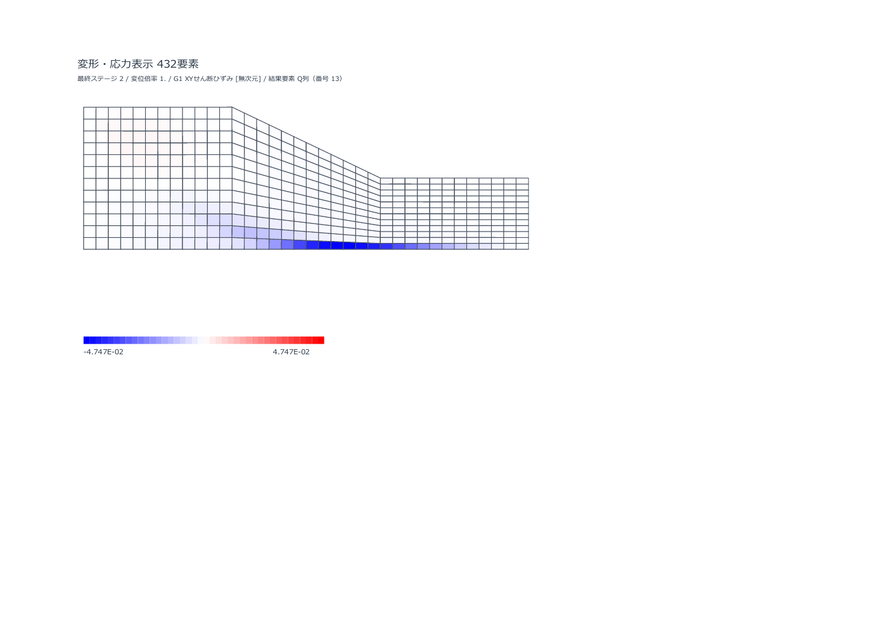
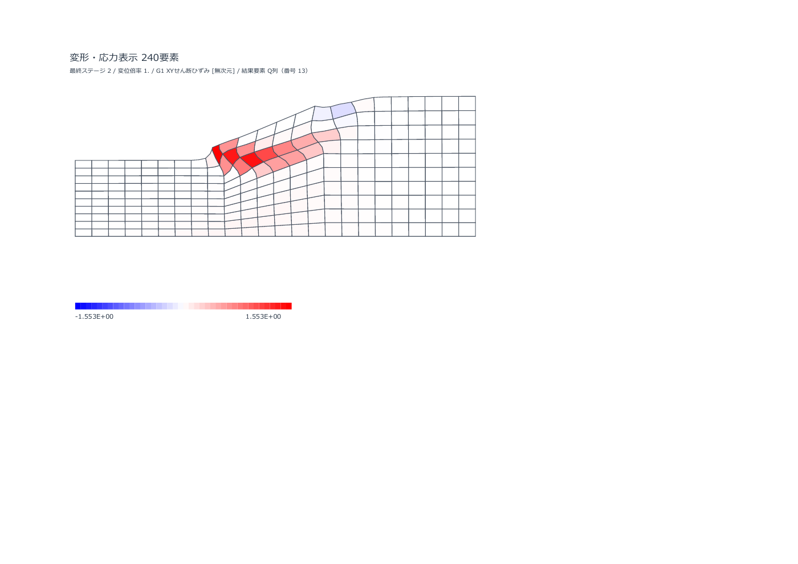

# 限界安全率と実用性の追加検証（2026-10-09）

以下はINCO_14～16の検証履歴である。後続の失敗原因分析・改修・同一入力による再検証は [INCONSISTENT SRMの追加改修](INCONSISTENT_SRM_IMPROVEMENT.md) を参照。

## 判定

**現時点では、一般の斜面について、このブック単独で最終設計用の限界安全率を決定できるとは確認できていない。** 一部の均質斜面ではDAVISの数値的な収束境界が比較値に近い。一方、INCONSISTENTでは限界付近で数値失敗となり、安全率を確定できないケースが続いた。非収束を低い安全率へ置き換えることはしない。

これまでの弾性理論解・小モデルの施工機能の確認は有効である。ただし、機能が動くこと、固定Fsで釣合うこと、限界安全率を精度よく求めることは、それぞれ別の確認である。今回の判定は乾燥・均質またはφu=0の全応力斜面についてのもの。間隙水圧、浸透、圧密、破壊後の移動距離は扱っていない。

## 出典とモデル

主比較は [Griffiths–Lane (1999)](https://inside.mines.edu/~vgriffit/slope64/Griffiths%20and%20Lane%201999) の乾燥均質斜面と、φu=0の均質化条件を使用した。補助比較は同論文の基礎付き斜面と [Pruškaのソフト比較資料](https://data.fine.cz/handbooks-chapter-pdf/16_comparison_of_geotechnic_softwares_geo_fem_plaxis_z-soil.pdf) の均質Soil1である。文献の不明な初期応力・側方境界などを現行ソフトに合わせて再構成した条件は、完全再現とは区別する。

|モデル|形状・材料・境界の要点|Q8要素数|比較の位置づけ|
|---|---|---:|---|
|Griffiths例1|H=10、水平距離20、天端12、c=10、φ=20°、ψ=0、γ=20、E=100000、ν=0.3。左ux=0、底ux=uy=0|200 / 450|主比較。論文の全載荷PASS 1.35 / FAIL 1.40と、既存比較値1.38を併記|
|Griffiths例2・基礎付き|例1と同材料、基礎深さH/2。右側平場16mは図からの再構成。両側ux=0、底ux=uy=0|240|補助比較。境界と側方延長を完全再現していない|
|Griffiths例3・均質φu=0|cu2/cu1=1、cu/(γH)=0.25。H=10、cu=50、γ=20、φ=ψ=0。天端2H・斜面水平距離2H・下部平場2H、基礎深さH、全深さ2H。E=100000、ν=0.3と側方ローラーを再構成値として明示|192 / 432|主比較。Taylorの1.47と比較。図のFE値の0.05丸めを踏まえた参照区間1.45～1.50も使用|
|Pruška h=7、φ=10°|幅40、上・下平場各15、斜面水平距離10、基礎厚8。c=20、γ=24、E=5000、ν=0.3、ψ=0。両側ux=0、底ux=uy=0|240|補助比較。資料のMC値1.21～1.31、Bishop 1.22。資料のK0生成法は再現できていない|
|Pruška h=7、φ=20°|上記と同じ、φ=20°|240|補助比較。MC値1.64～1.71、Bishop 1.65|
|Pruška h=10.5、φ=10°|上記と同じ、斜面高さ10.5|240|不安定側の補助比較。MC値0.83～0.91、Bishop 0.84|

長さm、応力・E・cはkPa、γはkN/m³、板厚1mで入力した。φu=0は全応力の非排水強度による比較で、間隙水圧モデルを追加したものではない。各節点、材料、要素、拘束、ステージは同梱の`fixtures.json`で確認できる。

## 検証方法

元のINCO_14を固定し、ケースごとに別ブック・別Excelで実際のVBAを実行した。固定Fsの再実行に加え、今回の主対象はFs探索である。REAPPLY、SRM_TOL=0.0125、SRM_FMAX=2.2、ψ保持、BAND_LU、RCM=ON、標準Q8安定化係数0.05を使用した。材料値や残差許容値を文献値に合うよう調整していない。同時実行の所要時間は速度比較には使わない。

INCONSISTENTはψ=0の非関連流れの経路。DAVISは配布時の選択値である。φ>0のDAVISは強度と流れ則を変えるため、元のψ=0問題との一致を認定する主比較には使わない。φ=0ではこの材料変換が消え、材料・流れ則の指定は同じになる。ただし、材料更新の実装、全体反復と線形計算の経路が違うため、解法の対照実験として扱う。

実用性の確認項目は次のとおりとした。

- 全自重が載り、自由度残差と反力釣合いが相対1e-5以下であること。
- 成功した解析にFs下限・上限の区間があり、幅が0.0125以下であること。数値失敗・停滞・容量不足・中断から上限を作らないこと。
- 同じ材料・流れ則の比較では参照区間外へのずれが5%以内、粗密メッシュのFs中央値の差が2%以内であること。
- 変形・局所ひずみ・破壊機構を確認し、小変形モデルの適用範囲を超える結果を変位予測として採用しないこと。
- 保存・再開・表示で、失敗した部分載荷の値を成功した安全率や結果図として扱わないこと。

5%・2%は今回の比較を整理するために宣言した目安であり、法令や全ての地盤に通用する許容値ではない。収束／非収束の区間も、数値手続き上の境界であって物理的な崩壊点の証明ではない。

## 限界安全率の結果

<!-- GENERATED_FOS_TABLE_START -->
|ケース|流れ則・版|Fs区間（数値境界）|最後の全載荷収束Fs|停止した試行Fs / λ|判定|
|---|---|---:|---:|---:|---|
|Griffiths例1・粗|INCONSISTENT / INCO_14|未確定|1.3000|1.400 / 0.924375|GLOBAL_STAGNATION|
|Griffiths例1・粗|DAVIS / INCO_14|1.3375～1.3500|1.3375|—|参考：強度・流れ則の変更あり|
|Griffiths例1・細|INCONSISTENT / INCO_14|未確定|1.3000|1.400 / 0.897904|GLOBAL_STAGNATION|
|Griffiths例1・細|DAVIS / INCO_14|1.3250～1.3375|1.3250|—|参考：強度・流れ則の変更あり|
|Griffiths例2・基礎|INCONSISTENT / INCO_14|未確定|1.3000|1.400 / 0.912099|GLOBAL_STAGNATION|
|Griffiths例2・基礎|DAVIS / INCO_15|1.3375～1.3500|1.3375|—|参考：強度・流れ則の変更あり|
|Griffithsφ0・粗|INCONSISTENT / INCO_14|未確定|1.4000|1.500 / 0.986834|LINEAR_SOLVER|
|Griffithsφ0・粗|DAVIS / INCO_14|1.4375～1.4500|1.4375|—|材料・流れ則を固定した対照|
|Griffithsφ0・細|INCONSISTENT / INCO_14|未確定|1.4000|1.500 / 0.977212|LINEAR_SOLVER|
|Griffithsφ0・細|DAVIS / INCO_14|1.4375～1.4500|1.4375|—|材料・流れ則を固定した対照|
|Pruška h7 φ10|INCONSISTENT / INCO_14|未確定|1.2000|1.300 / 0.955040|GLOBAL_STAGNATION|
|Pruška h7 φ10|DAVIS / INCO_14|1.2250～1.2375|1.2250|—|参考：強度・流れ則の変更あり|
|Pruška h7 φ20|INCONSISTENT / INCO_14|未確定|1.7000|1.800 / 0.910430|GLOBAL_STAGNATION|
|Pruška h7 φ20|DAVIS / INCO_15|1.6625～1.6750|1.6625|—|参考：強度・流れ則の変更あり|
|Pruška h10.5 φ10|INCONSISTENT / INCO_14|未確定|なし|自重 / 0.764051|GLOBAL_STAGNATION|
|Pruška h10.5 φ10|DAVIS / INCO_15|未確定|なし|自重 / 0.724774|引き継ぎ不具合（INCO_16で修正）|
|Pruška h10.5 φ10|DAVIS / INCO_16|0.8000～0.8125|0.8000|—|参考：強度・流れ則の変更あり|
<!-- GENERATED_FOS_TABLE_END -->

`未確定`の行では、最後に全載荷で収束したFsを診断値として残す。これは限界安全率ではなく、停止した次の試行のFsを上限として組み合わせてもいない。失敗時のλ<1は、その試行で目標自重に到達していないことを示す。

成立したDAVISの表示Fsと資料の代表値の差を一覧にする。中央値は探索区間の中央であり、そのFsでの収束を別に確認した値ではない。φ>0の行は強度・流れ則が異なるため、下表の割合は表示値の比較であり、元のψ=0問題の誤差認定には使わない。

|条件|表示Fs区間の中央値|資料の比較値|表示値の差|比較上の制限|
|---|---:|---:|---:|---|
|Griffiths例1・粗|1.34375|1.38|−2.63%|DAVISによる強度・流れ則の変更|
|Griffiths例1・細|1.33125|1.38|−3.53%|同上|
|Griffiths例2・基礎|1.34375|1.35～1.40|参照区間の下端より−0.46%|流れ則の変更、側方形状・境界の再構成|
|Griffithsφ0・粗|1.44375|1.47|−1.79%|材料・流れ則を固定した対照、機構の確認が残る|
|Griffithsφ0・細|1.44375|1.47|−1.79%|同上|
|Pruška h7 φ10|1.23125|1.22|+0.92%|流れ則の変更、資料のK0生成法未再現|
|Pruška h7 φ20|1.66875|1.65|+1.14%|同上|
|Pruška h10.5 φ10|0.80625|0.84|−4.02%|同上、Fs<1引き継ぎ修正後の実解析|

差は通常行で`(中央値/比較値−1)×100`、基礎付き行で参照区間の下端1.35に対して計算した。比較資料の数値も解析法・メッシュ・丸めの影響を含む。

INCONSISTENTでも、φ=0の粗密メッシュではFs=1.4、Pruška h7・φ20ではFs=1.7まで全載荷が成立した。これらは照査に有用な下限側の情報である。今回の未確定判定は、全ての計算値が誤っているという意味ではない。次の試行の停止が解法の限界なのか力学的限界なのかを裏付けられず、限界Fsの精度認定を完了できなかったという判断である。

補足として、自重のみ・φ=0・小変形の完全塑性条件で、停止点が限界荷重だと仮定した場合の換算`試行Fs×λ`を調べると、Fs=1.5の粗メッシュは1.48025、細メッシュは1.46582で、Taylor 1.47に近い。この仮定で強度／自重比を換算した診断参考値であり、未収束点を使うため、上のFs区間や設計安全率には採用していない。φ>0や複数載荷の履歴にはこの単純換算を適用していない。数値障害と力学的限界を切り分ける追加検証の手掛かりになる。

φ=0のDAVISは粗密メッシュで同じ1.4375～1.4500となった。中央値1.44375はTaylor 1.47に対し−1.79%、独立Bishop 1.4717に対し約−1.90%。Fsのメッシュ差は0%だった。全載荷の残差と支持反力の釣合いも確認した。ただし、せん断ひずみが底部に強く局所化しており、図から円弧状の破壊機構との一致を十分には確認できなかった。Fsの一致のみで適用範囲を拡大しない。

同じφ=0の粗メッシュをINCO_15・DAVISで再実行し、安定化係数を変えた。係数0は安定化を切った感度確認で、配布値を変更する提案ではない。

標準係数0.05の行はINCO_14、係数0と0.1は材料・反復を変更していないINCO_15の追加測定である。各版の原ブックと測定値を残した。

|Q8安定化係数|Fs区間|中央値|標準値からの中央値の差|
|---:|---:|---:|---:|
|0|1.4500～1.4625|1.45625|+0.87%|
|0.05（配布値）|1.4375～1.4500|1.44375|基準|
|0.1|1.4500～1.4625|1.45625|+0.87%|

差は今回の区間幅0.0125と同程度で、係数に対する単調な変化ではなかった。Fsが近いことは確認できたが、細かな誤差順位や安定化に全く依存しないことまで認定しない。

Griffiths例1の粗メッシュDAVISは1.3375～1.3500だった。中央値を元の比較値1.38と形式的に比べると−2.63%だが、φ>0のDAVISによる強度・流れ則の変更を含む。元問題の精度誤差として認定しない。強度だけの等価指標`√(Fs²+tan²φ0)`を算出できるが、これは流れ則を戻さないため、補正済みの安全率として表示しない。

細メッシュDAVISは1.3250～1.3375、中央値1.33125で、粗メッシュから−0.93%だった。宣言した2%以内のメッシュ比較の目安には収まる。強度だけの等価区間は粗1.3861～1.3982、細1.3741～1.3861となり、元の比較値1.38に近い。表示Fsの単純な差だけからコードの誤りを断定せず、強度倍率と流れ則の定義をそろえて評価する必要がある。

## 独立した円弧すべり計算

VBAの材料更新・行列・非収束判定を使わず、乾燥均質斜面のBishop簡便法を別に計算した。2つの探索seedで候補を調べ、640分割の候補を固定して80/160/320/640分割で比較した。地表の折れ点・底面の逸脱・反復式の最終残差を確認した。円弧に限定した有限探索であり、大域的最小値の証明ではない。

Pruškaは左右を反転して高い地表から低い地表へ計算する座標系を使った。材料・自重・左右の拘束は対称なので、この反転は同じ問題である。

|条件|独立Bishop（640分割）|資料の比較値|差の目安|
|---|---:|---:|---:|
|Griffiths例1|1.37808|1.38|−0.14%|
|Griffiths例3・φ=0|1.47171|1.47|+0.12%|
|Pruška h7、φ10|1.21898|1.22|−0.08%|
|Pruška h7、φ20|1.64228|1.65|−0.47%|
|Pruška h10.5、φ10|0.79975|0.84|−4.79%|

不安定ケースは別計算でもFs<1になったが、0.84への完全一致ではない。形状の再構成と探索の違いを残し、材料値を合わせていない。2seedの640分割結果差は最大約1.7e-6。φ=0では同じ円弧のせん断抵抗モーメント／自重モーメントを区分的に解析積分し、1.4717204を得た。640分割との差は相対1.02e-5以下である。Q8の変位勾配の集計も、既知のアフィン変位場800積分点で別途確認した。

## 変位と小変形の適用範囲

成功した探索結果の保存状態は収束したFs下限に戻した全載荷状態である。失敗したケースの保存変位は最後の部分載荷状態の診断値であり、釣合い解の変位予測ではない。両者を混ぜて論文の変位との差としない。

SRM限界付近の変位は、強度を人工的に変えた試行状態の変位であり、元の強度・実荷重時の変位そのものではない。したがって、大きな試行変位だけで通常の変位計算が誤っている、またはFsが誤っているとは断定しない。Fsの比較には、初期形状を固定する仮定や破壊機構への影響を併せて確認する。

<!-- GENERATED_DEFORMATION_TABLE_START -->
|成功ケース・Fs下限|最大成分変位 mm|最大ベクトル変位 mm|最大局所ひずみ %|最小det(I+∇u)|相対残差|相対反力不釣合い|
|---|---:|---:|---:|---:|---:|---:|
|Griffiths例1・粗・DAVIS Fs=1.3375|9.200|9.278|0.519|0.998484|5.107e-10|3.557e-13|
|Griffiths例1・細・DAVIS Fs=1.3250|8.824|8.864|0.423|0.998473|4.462e-06|2.964e-08|
|Griffiths例2・基礎・DAVIS Fs=1.3375|59.621|62.274|4.527|0.997730|2.250e-07|9.579e-12|
|Griffithsφ0・粗・DAVIS Fs=1.4375|65.981|66.787|3.239|0.995828|6.083e-07|1.728e-09|
|Griffithsφ0・細・DAVIS Fs=1.4375|65.990|66.904|4.752|0.995788|1.226e-06|1.483e-12|
|Pruška h7 φ10・DAVIS Fs=1.2250|701.983|725.254|28.509|0.938970|6.560e-11|1.201e-13|
|Pruška h7 φ20・DAVIS Fs=1.6625|2262.859|2291.975|183.029|0.211851|6.184e-06|1.697e-14|
|Pruška h10.5 φ10・DAVIS Fs=0.8000|794.560|801.490|37.868|0.931296|3.602e-10|1.011e-13|
<!-- GENERATED_DEFORMATION_TABLE_END -->

大きな局所ひずみや変形勾配の逆転は、材料接線の不具合を単独で証明するものではない。しかし、この小変形モデルで、その状態の変位絶対値を実物の移動量として使う根拠にもならない。Pruška h7・φ10のDAVISでは全載荷の残差が小さくても局所ひずみが約28.5%に達した。このため、Fsの比較と変位の実用性を分けて評価する。

前回のGriffiths固定Fs=1.35の最大成分変位12.1007mm（論文換算10.88mmとの差+11.22%）は、[既存の固定Fs確認](INCONSISTENT_REPAIR.md)に残す。固定Fsの変位一致は、今回の限界Fs探索の成立を代替しない。

## 見つかった保存値の不具合と修正

INCO_14では、Pruška不安定ケースの自重解析がSRM開始前に停止した際、解析は失敗・結果図は拒否されたが、内部`FSS`に初期値1が残った。診断からの誤読につながるため、INCO_15で修正した。

有効なSRMステージを含む解析が失敗した場合、最終の`FOS_INTERPRETATION`を`UNDETERMINED`にし、Fs表示値・上限・中央値・区間幅・スナップショットを無効にする。最後の収束試行の`P3FosPass`は診断履歴として保持し、テキストログも`FOS=UNDETERMINED`、`FOS_MID=NA`とする。容量不足・材料エラー・中断などの停止理由は保存する。

Pruška不安定ケースもINCO_15・INCONSISTENTで実際に再解析し、自重λ=0.764051で同じ停滞となった際、`FSS=0`・`UNDETERMINED`が保存されることを確認した。全体停滞は数値障害として扱うため、ここから定量的な限界Fsを求めていない。

同じ不安定ケースのDAVISでは、別の引き継ぎ不具合も再現した。Fs=1の自重が塑性点を伴うLINE_SEARCH非収束になり、既存の条件ではFs<1の探索へ引き継ぐ対象だった。しかし、引き継ぐ直前に失敗状態を消していたため、再利用したFs=1の試行が数値障害へ誤分類され、原因のない`RUNTIME_ERROR`になった。INCO_16では次の独立Fs試行が始まるまで元の非収束状態を保持するよう修正した。材料・線形障害・容量不足・中断を引き継ぎ対象にしない基準は維持する。

修正後の実解析は0.8000～0.8125、中央値0.80625となった。資料のBishop 0.84に対し−4.02%、今回の独立Bishop 0.79975に対し+0.81%。資料の初期応力を完全には再現しておらず、φ>0のDAVISでもあるため、補助比較として扱うが、不安定側を定量的に探索できることは確認できた。

`trial_class`は最後のSRM試行の分類である。SRM後の別ステージで停止すると`CONVERGED`が残ることがあるため、解析全体の成立判定には`analysis_ok`、`status`、`FOS_INTERPRETATION`を使う。診断欄の1項目だけで安全率を採用しない。

INCO_15は最終の値の保存とログ表記、INCO_16はFs<1探索への引き継ぎの修正である。材料モデル・接線・反復・許容残差は変更していない。8条件でSRM前の停滞・容量不足・材料エラー・中断、SRM後の載荷失敗、SRMなし・無効SRM、成功SRMを確認した。既存の材料・線形計算・回復・失敗分類の確認も配布するINCO_16で再実行した。

旧INCO_14のGit履歴と手続き本文を照合し、変更範囲がビルド表示、自重失敗の引き継ぎ、最終Fsの保存、ログ書式に限定されることを確認した。[変更範囲の照合](practical-evidence/source_scope16.json)。途中SRMの成立値と、その後の全ステージを含む解析全体の成立は区別する。

<!-- GENERATED_CHECK_SUMMARY_START -->
主探索17実行と補助3実行（停止値修正の再解析1、安定化感度2）を記録。完了した保存ブックを、入力7確認・VBA63確認・表示2確認で照合した。配布INCO_16の材料・ソルバ等198項目、停止時保存8条件、24回帰載荷、10施工条件×2流れ則、117結果確認、428設定・UI確認、35保存・再開確認とIssue #1の12条件は合格した。これらの合格と、限界Fsを確定できなかったケースの判定は区別する。

[確認結果とハッシュ](practical-evidence/verification_summary.json)、[入力と設定の保持](practical-evidence/preservation16.json)、[停止保存8条件](practical-evidence/failed_run_publication_checks.json)。
<!-- GENERATED_CHECK_SUMMARY_END -->

## 実務での扱いと改良の優先順位

|用途|今回の判断|理由|
|---|---|---|
|検証済みの線形弾性載荷・小モデルの機能確認|条件を合わせた照査・比較用に利用できる|既存の理論解、載荷、施工、接合の確認結果がある。実案件の入力・境界は別途照査する|
|今回のφ=0均質斜面のDAVISによるFs比較|限定した検討・他手法との照合に使える|Fs区間とメッシュ一致を確認。ただし、破壊機構と安定化設定への感度確認が必要|
|一般のψ=0非関連流れでの限界Fsの自動決定|実用性未確認|複数条件で数値失敗となり区間を得られない|
|φ>0でのDAVISの値を元の非関連流れ問題のFsとして採用|同じモデルとしては採用できない|強度と流れ則を変える。独立手法・別モデルとの照合が必要|
|大きな塑性変形・破壊後変位・間隙水圧を伴う問題|今回の確認範囲に含まれない|小変形・全応力の現在の経路では物理を再現していない|

次の改良は高速化より、数値失敗と力学的限界を分けるための解法の頑健性を優先する。

1. φ=0で材料・流れ則を固定し、INCONSISTENTとDAVISの接線・残差・拘束・反復経路の差を追う。今回は同じ材料でも解法によって成立が違うため、原因を絞りやすい。固定Fsの単独実行と連続Fs探索も同条件で照合し、材料履歴・初期化・増分選択の差を確認する。
2. 荷重制御の停滞点で、変位制御または弧長法による継続と反力・変位曲線を確認する。数値失敗を自動的に物理的破壊へ格上げしない。
3. Q8の安定化係数、境界の距離、載荷増分への感度と破壊機構を確認する。同じFsでも人工的な剛性や底面拘束の影響を点検する。
4. 資料の元入力が得られる独立ケースを追加し、初期応力・境界・要素・流れ則をそろえた比較を増やす。層状・接合・施工ステージのSRMへ適用範囲を広げるのは、その後とする。

## 証拠と再実行

<!-- GENERATED_EVIDENCE_LINKS_START -->
[安全率・変位の一覧CSV](practical-evidence/practical_comparison.csv)、[条件・診断・判定のJSON](practical-evidence/practical_comparison.json)、[全入力fixture](practical-evidence/fixtures.json)、[独立Bishopの探索・分割確認](practical-evidence/independent_bishop.json)、[追加集計の解析式確認](practical-evidence/tool_checks.json)。

実行用ブック・生ログ・応力・変位・VBA照合・初期／成功結果図を、版別にまとめた。

- [INCO_14のケースと固定原ブック](practical-evidence/srm_cases_INCO14.zip)
- [INCO_15／16の修正確認・追加ケース・安定化感度と固定原ブック](practical-evidence/srm_cases_INCO15_16.zip)

成功したφ=0細メッシュのせん断ひずみ。底部への局所化は見えるが、円弧状機構の一致をこの図だけで認定していない。



Pruška h7・φ20のSRM下限状態。強度を変えた試行状態で大きく変形しており、元の材料・実荷重での移動量として扱わない。


<!-- GENERATED_EVIDENCE_LINKS_END -->

INCO_14の原ブックSHA256は`21a6815238d694853ce4435ba6f4db7a0cdf56879b8f2eeadd981a24d56c26cd`。INCO_15は`fac30df6e3f8355ba5d8529b65aa7af05f87247c6eeaf36176beaba1b27b58a7`。配布するINCO_16は`a4c4ca06c794fc3128175a04bdd50eef2a6694914d0a56747a8bdf6597841db7`。ケースごとのビルド・原ブックSHA・入力・保存値はJSONとXLSMで照合できる。

初期の2実行（Griffiths粗INCONSISTENT、Pruška h7φ10 INCONSISTENT）は開始時のfixture SHA記録を追加する前に起動した。その記録を後から作ったことにはせず、厳密な開始時同一性監査には未合格として残した。保存した6入力表は現在のfixtureと全セル照合し、一致を確認した。これら2件は限界Fsの精度認定に使っていない。後続実行はfixture SHAを起動時から保存した。

WindowsのデスクトップExcelで次のように実行できる。VBAプロジェクトへのアクセスを許可した検証環境を使用し、実案件のブックのコピーで作業する。

```powershell
python tests/literature/build_practical_fixtures.py --output tests/tmp/practical/fixtures.json
powershell -NoProfile -File tests/literature/run_practical.ps1 -Names 'griffiths_1999_phi0_*' -PythonPath python
powershell -NoProfile -File tests/literature/run_practical.ps1 -Names 'griffiths_1999_phi0_*' -FlowPolicy DAVIS -AsControl -OutputRoot tests/tmp/practical_davis -PythonPath python
python tests/literature/independent_bishop.py --output tests/tmp/bishop.json
powershell -NoProfile -File tests/inconsistent/run.ps1 -PythonPath python
```

`run_practical.ps1`はレビュー済み原ブックSHA以外を拒否する。新しい版の検証ではプロトコルをその版に更新する。失敗解析の変位集計には`partial-load failed-trial diagnostic`の表示を付ける。文献PDFの再配布はせず、上記の原資料へのリンクを残す。
