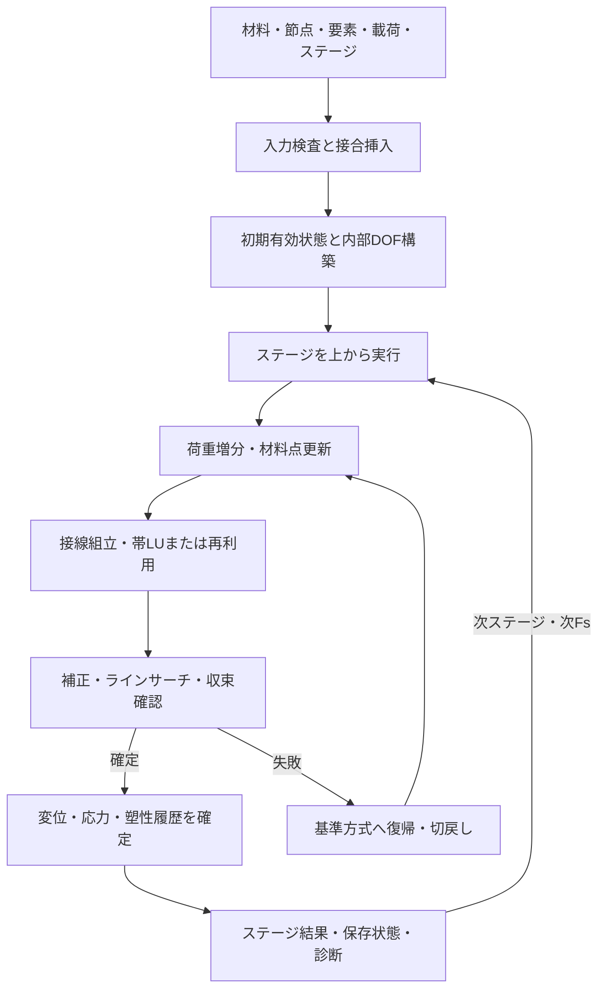

# プログラムの概要と保守

[READMEへ](../README.md) · [操作説明書](USER_GUIDE.md) · [高速化履歴](ACCELERATION_HISTORY.md) · [動作確認報告](VALIDATION.md)

## 計算の流れ

現行の通常解析は間隙水圧を考慮しない全応力解析で、2次元平面ひずみのQ8連続体と6節点JOINTを読み込み、施工ステージに従って釣合いを計算します。連続体材料の塑性更新にはMohr–Coulombの材料点処理を使用します。帯行列を組み立て、帯LUで補正を求め、ラインサーチ・切戻しを含むNewton制御で増分を確定します。RCMは内部節点順の並び替えで帯幅を小さくする機能です。入力・保存番号には元の節点番号を使います。



SRMでは対象材料の強度を低減し、各Fsで先行ステージをREAPPLYします。RESET/MATSETがある場合はその起点も管理します。数値収束の判定と、SHADOWの力学的な限界候補の監視は別です。詳細な材料点処理や収束許容値はVBAソースを参照し、手法比較時には固定してください。

## 主なモジュール

|ファイル|担当|
|---|---|
|[CONTROL.bas](../src/vba/CONTROL.bas)|操作入口、生成、解析開始、従来の描画処理|
|[FEM.bas](../src/vba/FEM.bas)|入力読込・検査、要素処理、組立、連続体結果回復|
|[FEMCore.bas](../src/vba/FEMCore.bas)|共有型・配列・定数・解析状態|
|[FEMEngine.bas](../src/vba/FEMEngine.bas)|施工順、SRM再生、Newton制御、材料点更新、JOINT|
|[FEMSolver.bas](../src/vba/FEMSolver.bas)|帯LU、分解再利用、GMRES、帯解法の比較試験|
|[FEMAdaptive.bas](../src/vba/FEMAdaptive.bas)|進行・採算に応じた高速化候補の選別|
|[FEMPolicyLog.bas](../src/vba/FEMPolicyLog.bas)|V2a試行・ゲートなどの診断記録|
|[FEMIo.bas](../src/vba/FEMIo.bas)|設定レジストリー、版情報、ログ、保存・再開|
|[FEMUi.bas](../src/vba/FEMUi.bas)|用途別入力C列と旧設定KEYの連携|
|[FEMUiLayout.bas](../src/vba/FEMUiLayout.bas)|操作導線、入力制限、入力欄の保護|
|[FEMUiGeometry.bas](../src/vba/FEMUiGeometry.bas)|形状入力から内部の図形定義への変換|
|[FEMViewer.bas](../src/vba/FEMViewer.bas)|保存表を読む初期／全体／結果ビューア|
|[FEMPractical.bas](../src/vba/FEMPractical.bas)|接合結果の保存と操作導線|
|[Mesh.bas](../src/vba/Mesh.bas)|形状メッシュ生成、共有辺のJOINT挿入|
|[MeshAdapt.bas](../src/vba/MeshAdapt.bas)|メッシュ候補、品質比較、採用・バックアップ|
|[ThisWorkbook.cls](../src/vba/ThisWorkbook.cls)|起動時処理、入力変更時の結果無効化|

その他のモジュールも [src/vba](../src/vba) に収録しています。`modules.json` は取り出したモジュールの一覧です。

## 高速化手法と現在の採用方針

|手法|狙い|配布値|
|---|---|---:|
|V1|前の確定変位増分から初期予測し、補正を減らす|1|
|V2a|小さな接線変化等の条件で前増分LUを最初の補正に再利用|1|
|V2b|補正改善と費用の見積りに応じて接線更新を延ばす|0|
|V3|費用を考慮した探索候補|0|
|V4|履歴からAnderson候補を作り、補正を改善する|1|
|V5|旧LUを前処理にしたGMRES候補|0|
|適応選別|ONの候補を、適格性・進行・採算で休止／再採用|1|
|増分幅回復／fresh LU試験|増分幅を増やす追加試験|0／0|

配布版は実測で最良だったADAPT_03の選別方式を復元しています。V1は直前の反復数が5以下の履歴に限定し、V2aはSHORT（0〜5）とLONG（6以上）を別に評価します。qの悪い経路の休止と推定損失の休止を、経路別に管理します。高速化候補が不適切な場合は基準補正へ復帰します。手法ごとのONは、適応選別がONのときには毎回実行を保証する指定ではありません。

増分幅の追加回復は、後続版で時間が増えたため配布値をOFFにしています。新しい診断ログと実務不具合の修正は保持しています。単独・組合せ・適応版の測定値、採用理由と未測定部分は [高速化履歴](ACCELERATION_HISTORY.md) にまとめています。

## 全応力と休眠コードの範囲

本番の `P6SelectSolverMode` はBAND固定で `P6UseCSR=False` とします。選択肢の `BAND_LDLT_EXPERIMENTAL` も影の比較で、本番補正はLUです。ソースに残るCSRの `MIXED_UP` は機械的非圧縮性の補助未知量を扱う別経路であり、物理間隙水圧と同一ではありません。本番ではこのCSR経路も起動しません。

Biot圧密の `CONSOL_ENABLE` は通常設定にありません。以前は設定再生成時にこのキーを除去していましたが、レビュー修正版では解析入口で非0を拒否し、Biot入口にも同じ防止処理を置いています。休眠コードのH行列・圧力勾配・施工領域・u/pの試行状態は、圧密やCSR混合を将来実装する際の検証課題です。[Issue #1の判定と再現](ISSUE_1_REVIEW.md) を参照してください。

JOINTはψ=0の履歴なし応力上限モデルです。塑性すべり履歴を持つ弾塑性接合への拡張は今回含めません。

## 開発・再検証

実行用はXLSMです。収録した `.bas/.cls` は日本語を保持するUTF-8のCodeModule本文で、VBEエクスポートのAttribute行やブック全体の構造を含みません。そのままインポートして実行ブックを再構成する形式ではありません。ソース変更をブックへ反映する開発では、作業コピーを使い、対象モジュールを明示して反映・コンパイル・検証します。

Windows、デスクトップExcel、PowerShellで、リポジトリのルートから次を実行します。

```powershell
powershell -NoProfile -ExecutionPolicy Bypass -File tests/run.ps1
```

テストでは「VBAプロジェクト オブジェクト モデルへのアクセスを信頼する」が必要です。専用Excelインスタンスと `tests/tmp` のコピーにテストコードを追加し、`tests/results` に記録します。テストは配布ブックへコードを書き戻しません。

収録テストは小モデルの回帰、材料点・制御、失敗からの復帰、載荷・施工・JOINT、結果保存・図表示、設定KEY・入力制限等を確認します。詳細な件数と結果は [動作確認報告](VALIDATION.md) にあります。ソルバーやステージ処理を変更するときは、成功ケースだけでなく失敗後の履歴復元と同じ荷重目標への復帰も確認します。

`MANIFEST.json` は配布ファイルのバイト数とSHA-256です。更新時は変更ファイルの記録も更新します。`.gitattributes` は元ファイルのバイト列を保持する設定です。

## 検証範囲

今回の確認は小モデルの回帰・実務不具合の再現条件が中心です。フルサイズのJOINT非線形解析、複雑な多接合・施工履歴、圧密・混合u-pの全面検証は含みません。ソース中に処理が存在することと、配布版の実務機能として検証済みであることは別です。通常の利用手順は [操作説明書](USER_GUIDE.md) の範囲から開始してください。
